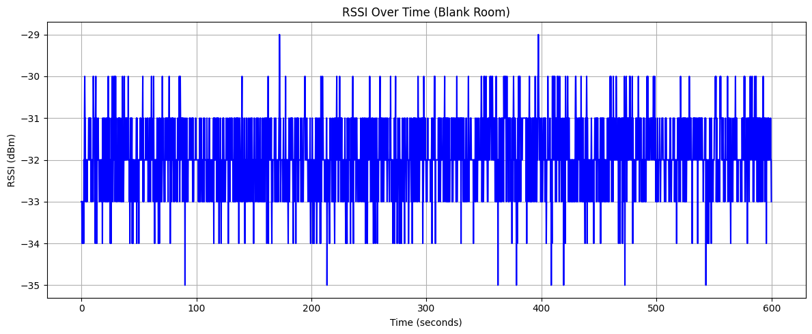
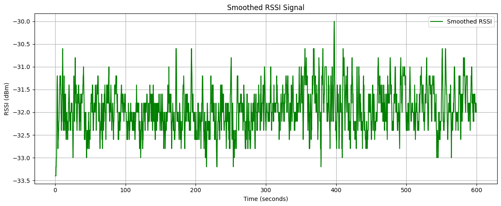
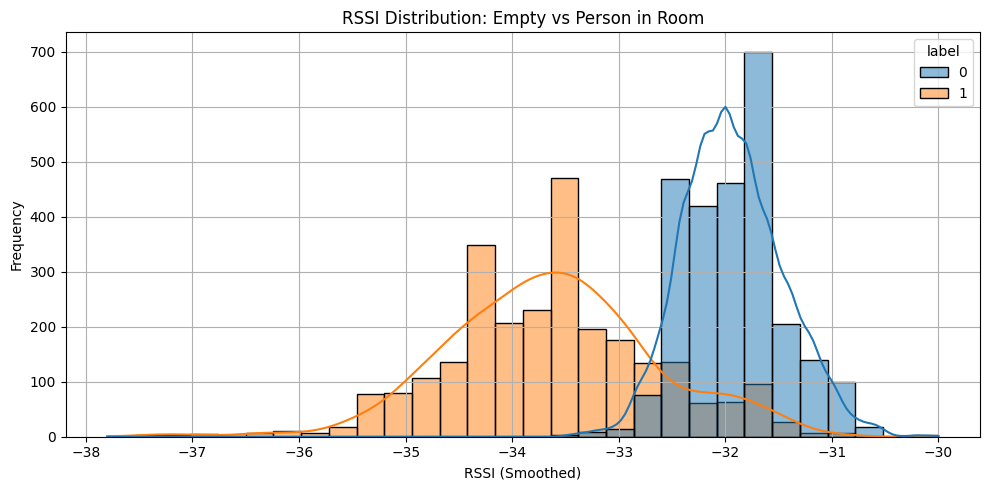
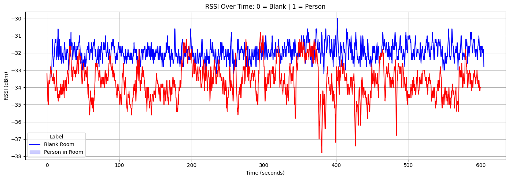
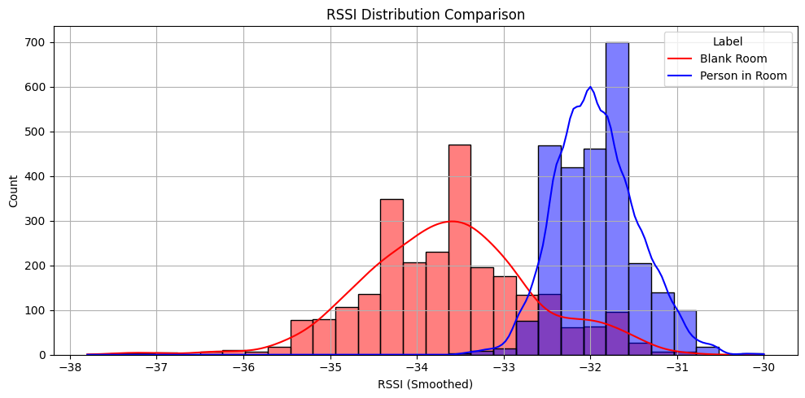
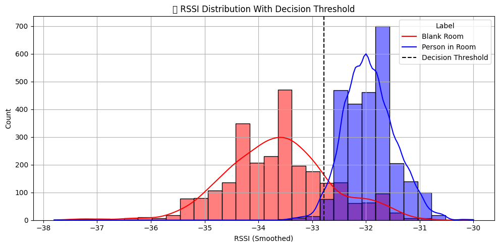

# ESP32 Smart Presence Detection using WiFi RSSI and Machine Learning

This project detects whether a person is present in a room using WiFi signal strength (RSSI) and machine learning. It runs fully on ESP32 with MicroPython, using an OLED display, buzzer, and SD card for real-time alerts and data logging.

---

## Features

- Passive human presence detection using WiFi RSSI
- Machine learning model distinguishes between empty and occupied room
- Real-time classification and alerts via buzzer and OLED
- Data logging to SD card in CSV format
- MicroPython-based and runs directly on ESP32
- Privacy-respecting and camera-free system

---

## Hardware Used

| Component        | Description                     |
|------------------|---------------------------------|
| ESP32 Dev Board  | With built-in WiFi              |
| OLED Display     | SSD1306 (128x64)                |
| Buzzer           | PWM-controlled for alerts       |
| Buttons          | For UI controls (select/back)   |
| SD Card Module   | For logging data (`/sd/ML/*.csv`) |

---

## Data Logging Structure

| File Name         | Scenario           |
|------------------|--------------------|
| `blankroom.csv`   | No person present  |
| `personinroom.csv`| Person in the room |

Each file contains timestamped RSSI values from nearby WiFi access points.

---

## Machine Learning Workflow

1. Collect RSSI data under both scenarios
2. Train a machine learning model in Jupyter Notebook
3. Export a threshold-based or lightweight rule
4. Run real-time RSSI classification on ESP32
5. Trigger alert if human presence is detected

---

## How It Works

- ESP32 continuously scans available WiFi networks
- It extracts RSSI values and computes average signal strength
- These features are passed to a trained decision logic
- Based on comparison, it determines room status and raises alerts

---

## Applications

- Intrusion detection
- Room occupancy monitoring
- Smart home automation
- Office or lab security system
- Low-cost IoT surveillance

---

## Project Structure

```

/main.py                  # UI and system control
/scripts/rssi\_detect.py   # Real-time ML-based detection
/sd/ML/blankroom.csv      # RSSI data when room is empty
/sd/ML/personinroom.csv   # RSSI data when person is present

```

---

## Setup Instructions

1. Flash MicroPython on ESP32
2. Connect OLED, buzzer, SD card module, and buttons
3. Copy project files to ESP32
4. Run data collection, train model in Jupyter Notebook
5. Execute real-time detection script from UI

---

## blankroom.ipynb
```python


# blankroom.ipynb

# Step 1: Import libraries
import pandas as pd
import matplotlib.pyplot as plt
import seaborn as sns

# Step 2: Load CSV
df = pd.read_csv("blankroom.csv")
df['time_s'] = (df['timestamp_ms'] - df['timestamp_ms'].min()) / 1000  # Convert to seconds

# Step 3: Basic info
print("✅ Total Samples:", len(df))
print("📉 RSSI Range:", df['rssi'].min(), "to", df['rssi'].max())
print("📊 Avg RSSI:", df['rssi'].mean())

# Step 4: Plot RSSI over time
plt.figure(figsize=(12,5))
sns.lineplot(data=df, x="time_s", y="rssi", color='blue')
plt.title("RSSI Over Time (Blank Room)")
plt.xlabel("Time (seconds)")
plt.ylabel("RSSI (dBm)")
plt.grid(True)
plt.tight_layout()
plt.show()

# Step 5: Optional - Smooth/clean data
df['rssi_avg'] = df['rssi'].rolling(window=5, center=True).mean()

# Step 6: Plot smoothed RSSI
plt.figure(figsize=(12,5))
sns.lineplot(data=df, x="time_s", y="rssi_avg", color='green', label="Smoothed RSSI")
plt.title("Smoothed RSSI Signal")
plt.xlabel("Time (seconds)")
plt.ylabel("RSSI (dBm)")
plt.grid(True)
plt.tight_layout()
plt.show()

# Step 7: Save cleaned version
df[['time_s', 'rssi_avg']].dropna().to_csv("clean_blankroom.csv", index=False)
print("💾 Cleaned data saved as 'clean_blankroom.csv'")

```

    ✅ Total Samples: 2616
    📉 RSSI Range: -35 to -29
    📊 Avg RSSI: -31.933103975535168


    

    


    

    


    💾 Cleaned data saved as 'clean_blankroom.csv'


```python
import pandas as pd
import matplotlib.pyplot as plt
import seaborn as sns

# Load both datasets
df_blank = pd.read_csv("blankroom.csv")
df_blank["label"] = 0

df_person = pd.read_csv("personinroom.csv")
df_person["label"] = 1

# Combine
df_all = pd.concat([df_blank, df_person], ignore_index=True)

# Preprocessing
df_all["time_s"] = (df_all["timestamp_ms"] - df_all["timestamp_ms"].min()) / 1000
df_all["rssi_avg"] = df_all["rssi"].rolling(window=5, center=True).mean()

# Drop NaNs after smoothing
df_all = df_all.dropna()

# Plot RSSI by label
plt.figure(figsize=(10,5))
sns.histplot(data=df_all, x="rssi_avg", hue="label", bins=30, kde=True)
plt.title("RSSI Distribution: Empty vs Person in Room")
plt.xlabel("RSSI (Smoothed)")
plt.ylabel("Frequency")
plt.grid(True)
plt.tight_layout()
plt.show()

```


    

    


```python
from sklearn.model_selection import train_test_split
from sklearn.linear_model import LogisticRegression
from sklearn.metrics import accuracy_score, classification_report

# Features and labels
X = df_all[["rssi_avg"]]
y = df_all["label"]

# Split
X_train, X_test, y_train, y_test = train_test_split(X, y, test_size=0.2, random_state=42)

# Train
model = LogisticRegression()
model.fit(X_train, y_train)

# Predict
y_pred = model.predict(X_test)

# Evaluate
print("Accuracy:", accuracy_score(y_test, y_pred))
print(classification_report(y_test, y_pred))

```

    Accuracy: 0.9005736137667304
                  precision    recall  f1-score   support
    
               0       0.88      0.92      0.90       525
               1       0.92      0.88      0.90       521
    
        accuracy                           0.90      1046
       macro avg       0.90      0.90      0.90      1046
    weighted avg       0.90      0.90      0.90      1046
    


```python
# Step 1: Import
import pandas as pd
import matplotlib.pyplot as plt
import seaborn as sns

# Step 2: Load files
blank = pd.read_csv("blankroom.csv")
person = pd.read_csv("personinroom.csv")

blank["label"] = 0
person["label"] = 1

# Step 3: Merge both
df = pd.concat([blank, person], ignore_index=True)

# Step 4: Normalize time & Smooth RSSI
df["time_s"] = (df["timestamp_ms"] - df["timestamp_ms"].min()) / 1000
df["rssi_avg"] = df["rssi"].rolling(window=5, center=True).mean()
df = df.dropna()

# Step 5: Plot RSSI over time
plt.figure(figsize=(14,5))
sns.lineplot(data=df, x="time_s", y="rssi_avg", hue="label", palette=["blue", "red"])
plt.title("RSSI Over Time: 0 = Blank | 1 = Person")
plt.xlabel("Time (seconds)")
plt.ylabel("RSSI (dBm)")
plt.legend(title="Label", labels=["Blank Room", "Person in Room"])
plt.grid(True)
plt.tight_layout()
plt.show()

# Step 6: Plot Distribution
plt.figure(figsize=(10,5))
sns.histplot(data=df, x="rssi_avg", hue="label", bins=30, kde=True, palette=["blue", "red"])
plt.title("RSSI Distribution Comparison")
plt.xlabel("RSSI (Smoothed)")
plt.ylabel("Count")
plt.legend(title="Label", labels=["Blank Room", "Person in Room"])
plt.grid(True)
plt.tight_layout()
plt.show()

# Step 7: Print Stats
grouped = df.groupby("label")["rssi_avg"].agg(["min", "max", "mean", "std"])
grouped.index = ["Blank Room", "Person in Room"]
print("📊 RSSI Summary Stats:\n")
print(grouped)

```


    

    


    

    


    📊 RSSI Summary Stats:
    
                     min   max       mean       std
    Blank Room     -33.4 -30.0 -31.932364  0.467858
    Person in Room -37.8 -30.8 -33.631663  0.975385


```python
plt.figure(figsize=(10,5))
sns.histplot(data=df, x="rssi_avg", hue="label", bins=30, kde=True, palette=["blue", "red"])
plt.axvline(x=-32.78, color='black', linestyle='--', label='Threshold = -32.78 dBm')
plt.title("📊 RSSI Distribution With Decision Threshold")
plt.xlabel("RSSI (Smoothed)")
plt.ylabel("Count")
plt.legend(title="Label", labels=["Blank Room", "Person in Room", "Decision Threshold"])
plt.grid(True)
plt.tight_layout()
plt.show()

```

    /tmp/ipykernel_685157/2097943429.py:9: UserWarning: Glyph 128202 (\N{BAR CHART}) missing from font(s) DejaVu Sans.
      plt.tight_layout()
    /home/max/mlenv/lib/python3.12/site-packages/IPython/core/pylabtools.py:170: UserWarning: Glyph 128202 (\N{BAR CHART}) missing from font(s) DejaVu Sans.
      fig.canvas.print_figure(bytes_io, **kw)


    

    


## License

MIT License — Open-source, free to use and modify.

---

## Author

Developed by Mahendra Mali  
Cybersecurity and IoT Researcher  
Website: [https://mahendraplus.github.io](https://mahendraplus.github.io)  
GitHub: [https://github.com/mahendraplus](https://github.com/mahendraplus)


